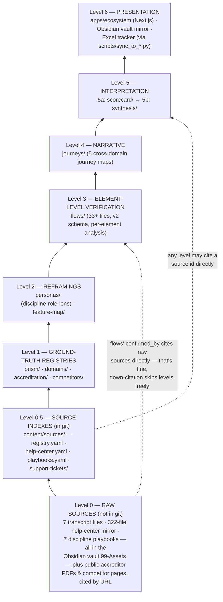

# content/ Architecture — The Layered Evidence Model

**What this is:** the one document that explains how every `content/` subfolder relates
to every other one. The README lists the folders flat; this explains the *dependency
structure* between them. Reference document — scan it, don't read it cover to cover.

**Last updated:** 2026-08-24

---

## The one rule that matters

> **Every file cites only the level(s) below it. Never sideways. Never up.**

That's the whole architecture. Everything else in this document is elaboration.

**Why the rule exists — citation laundering.** This repo exists to answer questions
like "does Prism satisfy COCA element 6.10?" for an audience (leadership, marketing,
eventually accreditors' customers) that will act on the answer. The failure mode of
research repos is *circular evidence*: a synthesis doc asserts X, a journey narrative
cites the synthesis, a flow file cites the journey, and six weeks later "confirmed"
means "we wrote it down three times." One layer's confident prose becomes the next
layer's ground truth, and no one can tell which claims trace to a transcript and
which trace to our own earlier guess. An accreditation-evidence research repo cannot
afford that — the entire pitch is *computed, traceable evidence*. So the citation
graph is a strict DAG pointing downward, and `git blame` plus a `source:` field on
every claim is the audit trail.

This is why `flows/_TEMPLATE.yaml` says, in so many words: *never re-derive from the
journey's own narrative, which would be citing our own synthesis as ground truth.*
That local rule is just this global rule applied to one edge.

**The analogy that fits: a legal case file.** Raw testimony (transcripts, the
help-center mirror) → exhibits entered into the record (the Level-1 registries, each
fact tagged with where it came from) → deposition-grade verification (flows, checked
element by element) → the brief (journeys, the narrative built on verified facts) →
the argument (synthesis and positioning, what we tell the room). A brief that cites
its own argument gets thrown out; so does a flow that cites its journey. And like
geological strata: when new evidence lands, a lower layer is *annotated, not silently
rewritten* — see the dated correction block at the top of `synthesis/gap-analysis.md`,
where Pattern G ("Prism has no matching layer") was overturned by the internal PA/OT
playbooks and the correction was left visible instead of the claim being quietly
edited. Upper layers can reference a lower stratum; they cannot contradict it without
first fixing the stratum itself.

---

## The levels

Arrows point in the *citation* direction inverted — each level may cite anything at
any level below it (skipping levels is fine; flows cite Level 0 transcripts directly).
No level cites its own level or above.

---

## Level 0 — Raw sources (live in the Obsidian vault, NOT in this git repo)

| Source | Where it lives |
|---|---|
| 7 transcript files (16-part admin tutorial series + 6 discipline video sets: TE, SLP, PT/PTA, PA, OT/OTA, Nursing) | `PRISM-Expansion-Vault/99-Assets/` |
| 322-file help-center mirror (Exxat Prism Help Center extraction) | `99-Assets/documents/Exxat-Help-Guides/` |
| 7 internal discipline playbooks (PT, OT, PA, SLP, Nursing, Social Work, Teacher Education) — indexed in `content/sources/playbooks.yaml` | `99-Assets/documents/Playbooks/` |
| 3 CSS & CX Zendesk knowledge-base screen captures (PA, OT, PT — "FireShot Capture 002/003/004"), named only in `prism/capability-map.yaml`'s source list; nothing else cites them | `99-Assets/` |
| Public accreditor standards PDFs (COCA 2026, ACPE 2025, CODA, LCME) and competitor marketing/docs pages | cited by URL from Level 1 |

These are the testimony. They are deliberately *outside* git (size, copyright,
internal-doc hygiene) but every in-repo claim that rests on them names the exact file
or article path in a `source:` / `confirmed_by:` field, so the chain of custody
survives the repo boundary.

`interviews/` is the in-repo slot for real CS/AM/leadership interviews as Romit
conducts them. First populated 2026-08-26 with two Granola meeting transcripts
(lightly cleaned of tech-support tangents, substance kept verbatim) — interview files
are raw testimony and nothing in them cites upward.

## Level 0.5 — Source indexes (`content/sources/`, in git, cite nothing)

Three in-repo index files plus one snapshot folder stand between the raw sources and
Level 1. They are citable
by any file at any level and cite nothing themselves. `registry.yaml` is the general
one — sparse, curated, one entry per individually found-and-checked source, referenced
by `source_id`. `help-center.yaml` and `playbooks.yaml` are dedicated *corpus* indexes
for the two Level 0 bodies too large and too internally-addressed for a flat registry
entry: the 322-file help-center mirror and the seven discipline playbooks. Use a corpus
index when a citation needs a per-citation `locator:` (a page, section, line range or
anchor *within* one document) alongside the `source_id`, which a flat registry entry
can't express cleanly; their ids are prefixed `help-center-` and `playbook-`.

An index entry is a pointer, not evidence. Both corpus files record a `path_status:` /
provenance note distinguishing a path quoted verbatim from an existing in-repo citation
from one nobody has opened, and both state that their `what_it_supports:` summaries
restate what an in-repo Level-1/Level-3 file asserts rather than a fresh reading of the
Level-0 document. Citing an index id back at the file its summary was derived from
would launder a claim, not corroborate it.

`support-tickets/` is the third shape: not an index of documents that live elsewhere but a
point-in-time *snapshot* of helpdesk data, one file per domain per capture date
(`<domain-slug>-<YYYY-MM-DD>.yaml`, ids prefixed `support-ticket-`). It exists because
support data was previously fetched live and rendered straight to the UI, which put an
uncited claim on screen and kept the reasoning for which tickets were chosen in a
source-code comment. Each snapshot therefore carries `selection_method`, `selection_query`
and `coverage_caveat` as first-class fields, and every ticket carries `redacted:` — false
until a human has read it for personal data. `scripts/snapshot_zendesk.py` writes these
files and is not permitted to set `redacted: true`. A snapshot records only what the
helpdesk actually returned; unknown fields stay null rather than being filled in.

## Level 1 — Ground-truth registries (cite only Level 0)

Four folders, one question each. These are the exhibits: flat factual records where
every non-trivial claim carries a `source:` pointing at Level 0.

| Folder | One file per | Question it answers |
|---|---|---|
| `prism/` (`capability-map.yaml`) | — (single file) | What does Prism *actually* ship, per internal docs — not assumptions? Defines the pillar vocabulary (shipped vs. 2027 roadmap) and named primitives everything above reuses. |
| `domains/` | expansion domain (do, pharmacy, dentistry, medicine) | What is the market context — program counts, enrollment trends, budget dynamics? |
| `accreditation/` | accreditor (coca, acpe, coda, lcme) | Standard → evidence programs must produce → required software behavior → Prism fit (**Transfer / Configure / Build / Gap**), at the numbered-element level. |
| `competitors/` | incumbent (9 files: axium, core-elms, e-value, elentra, emedley, leo-davinci, medhub, new-innovations, one45) | Feature-level teardown of each incumbent, from their public docs. |

**The relay-race baton — how a Level-1 primitive propagates.** The capability map
names Prism's *anchor-relative scheduling* primitive: publish/due dates set as
"N days before/after a placement's start/mid/end anchor," not as fixed calendar
dates. A fixed date is a starter's pistol at a scheduled clock time; anchor-relative
is a relay baton — the midpoint-evaluation leg starts *when the placement's baton
arrives*, wherever that lands on the calendar, for every student on every offset
rotation simultaneously. Because that fact is established **once, at Level 1, with a
transcript citation**, every layer above can reuse it without re-proving it:
`accreditation/lcme.yaml` rates element 9.7 (date-anchored midpoint feedback) as
mapping "almost one-to-one" onto it, `feature-map/do.yaml` builds an opportunity on
it, the scorecard's pillar-fit rationale weighs it, and `prism-positioning.md` sells
it. One exhibit, cited five times — never re-asserted from memory.

Note the internal cross-reference direction *within* Level 1:
`accreditation/*.yaml`'s `prism_fit_rationale` names pillars from
`prism/capability-map.yaml`. That is the one tolerated intra-level edge, and it only
points at the capability map (the vocabulary source), never between peer registries.

## Level 2 — Reframings (cite Level 1 and below)

Same facts, rotated to face a different audience. No new primary claims — a Level-2
file that needs a new fact sends it down to Level 1 first.

| Folder / file pattern | What it reframes |
|---|---|
| `personas/discipline-*.yaml` (11: the 4 expansion domains **plus** the 7 existing disciplines — nursing, OT, PA, PT, SLP, social-work, TE) | The *program* as archetype: accreditation pressure from `accreditation/`, current tools from `competitors/`, JTBD, switching triggers. |
| `personas/role-*.yaml` (5: program-admin, clinical-coordinator, compliance-accreditation-liaison, dean, preceptor) | The same evidence base sliced by human role instead of by discipline. |
| `personas/lens-*.yaml` (6) | Mirrors `competitors/<slug>.yaml` "reframed around roles, not features" — how each incumbent implicitly serves or fails each role, and the gaps Prism can exploit. |
| `feature-map/*.yaml` (4, one per expansion domain) | Pillar-by-pillar competitive verdict per domain (leading / behind / opportunity), citing `accreditation/` elements and `competitors/` files by name. |
| `dissection/*.yaml` (one per expansion domain) | Not the facts themselves but *where they are* — a per-domain manifest naming, for each of six fixed dissection questions, which file already answers it and how far along the research is (`coverage` / `confidence` / `gap_note`), pointing at the lenses and registries that hold the actual claims and duplicating none of them. Same "no new primary claims" rule as `personas/` and `feature-map/`; because it asserts nothing it carries no `sources:`, and an unanswered question stays visible as `coverage: "none"` plus a `gap_note` rather than as a missing field. |
| `lenses/*.yaml` (2 as of 2026-08-26: `accreditor-tiers.yaml`, `competitor-landscape.yaml`) | Cross-cutting rows×columns quick-scan views spanning all 12 domains at once, requested directly by the sales/product team (see `interviews/2026-08-26-wilson-nursing-crosswalk.md`). `accreditor-tiers` cites `accreditation/`, `domains/`, and `interviews/`; `competitor-landscape` cites `competitors/` by name (`threat` is this file's own synthesis judgment, not a field lifted from Level 1). A third lens, feature comparison, needs no content file at all — it's a pure re-visualization of `competitors/*.yaml`'s existing `feature_teardown`, scoped per domain by `domains_served` (`apps/ecosystem/lib/content.ts`'s `getFeatureComparisonForDomain`). |

**`related_flows` is navigation, not a citation — the one deliberate exception to "never
up."** `personas/jtbd`/`top_pains`/lens entries carry an optional `related_flows:
[{flow, step?, element?}]` field naming a `flows/*.yaml` file (Level 3) by filename. Read
literally, a Level-2 file naming a Level-3 file points *up* the strata, which looks like
exactly the citation-laundering pattern this document's one rule exists to forbid. It
isn't: `related_flows` grounds nothing — the persona entry's actual evidence is unchanged
(`evidence_or_rationale` / `accreditation_link`+`source` / lens `sources:`, all Level
0-1). The field only tells a reader "you can see this same point verified element-by-
element over here." This is the same footing `flows/*.yaml`'s own `maps_to_journey`
field already stands on — a Level-3 file naming a Level-4 journey, tolerated for
identical reasons. Both fields are wayfinding, not evidence.

## Level 3 — `flows/` — element-level verification (cites Levels 0–2)

33+ files, **schema v2** (2026-08-24), named
`<journey-slug>--<NN>-<stage-slug>.yaml` — one file per journey *stage*, across five
journey families (accreditation-self-study ×8, admin-onboarding ×8,
competency-verification ×8, preceptor-site-onboarding ×8, rotation-lifecycle ×8).

This is the deposition layer: screen-by-screen, and under v2, **element-by-element**
— `accreditation_citation`, `competitor_equivalent`, `gap_severity`, `gap_note` live
on each field, button, column, or toggle, not aggregated to the screen. Two hard
disciplines, both instances of the one rule:

- `confirmed_by` on every step names an exact **Level 0** source (help-center path,
  playbook, transcript section) — a flow asserts what a screen does because a
  document shows it, never because the journey narrative said so.
- `competitor_equivalent` is filled only where the competitor's public docs
  (Level 1's evidence base) support the comparison *at element granularity* —
  otherwise it says so explicitly rather than guessing.

Flows are the ground truth that journeys cite — the dependency runs strictly
flows → journeys, even though journeys were often *drafted* first. When a journey
stage gets its flow files written, the journey is thereby verified from below, not
the flows justified from above.

## Level 4 — `journeys/` — cross-domain narrative (cites Levels 0–3)

5 files: `rotation-lifecycle`, `accreditation-self-study`,
`preceptor-site-onboarding`, `competency-verification`, and (new 2026-08-24)
`admin-onboarding-product-setup` — the first journey scoped to **all eleven
disciplines** rather than the four expansion domains, which is why it carries
`discipline_variance` per stage instead of `domain_variance`.

The brief: stage-level narrative per journey — current state in Prism, pain/gap,
accreditation link, competitor comparison — with each stage's Prism assertions traced
to named flow files, transcripts, or Level-1 registries. Journeys are the
*cross-domain comparative* layer; flows are the *single-product verification* layer
under them. A journey may say "this stage is where COCA 6.10 evidence should fall
out"; only a flow may say "and here is the exact column on the exact screen that
produces it."

## Level 5 — Interpretation (cites Levels 0–4)

Two sub-strata, because positioning cites the scorecard:

**5a — `scorecard/where-to-play.yaml`.** The quantitative verdict: weighted criteria
(market size, accreditation pressure, incumbent weakness, pillar fit, …) scored per
domain, every rationale cell citing `domains/`, `accreditation/`, `competitors/`,
`personas/`, and `prism/capability-map.yaml` by name. Current answer: DO 4.40 >
Pharmacy 4.05 > Medicine 3.85 > Dentistry 2.75.

**5b — `synthesis/`.** The argument, in four documents:

| File | Role |
|---|---|
| `gap-analysis.md` | Cross-cutting patterns (A, B, … G) across all four domains; carries the visible Pattern-G correction block — the model example of annotating a stratum instead of rewriting it. |
| `vocabulary-glossary.md` | The "vocabulary-ahead" glossary: term → definition → Prism pillar → how to say it to a dean; every entry cites its on-disk Level-1 file *and* that file's primary source. |
| `prism-positioning.md` | The GTM brief — explicitly "a positioning brief, not a research document," downstream of journeys (element-verified via flows), the capability map, and the scorecard. |
| `positioning-and-element-flows-plan.md` | The plan document that specified the v2 flow methodology and positioning approach — process record, kept for traceability. |

`positioning-and-element-flows-plan.md` has **no page in `apps/ecosystem/` by
design** — it is a process record kept for traceability, not reader-facing content,
so its absence from the app is intentional and not a coverage bug. The other three
synthesis documents each render at `/synthesis/gap-analysis`,
`/synthesis/vocabulary`, and `/synthesis/positioning`.

Nothing below Level 5 ever cites anything in this folder. If a synthesis insight
deserves reuse, it gets pushed down: a fact goes to a Level-1 registry with a real
source, or it stays opinion and stays here.

## Level 6 — Presentation (renders Levels 1–5; asserts nothing)

- **`apps/ecosystem/`** — the Next.js + shadcn/ui + d3/Observable Plot app that reads
  `content/` at request time for a leadership/marketing audience. Display only; it
  contains no research claims of its own.
- **Obsidian vault mirror** — `scripts/sync_to_vault.py` mirrors `content/` into
  `PRISM-Expansion-Vault` (the human-owned folders — 00-Inbox, 40-Interviews,
  70-GTM-with-Ruchi, 90-Templates — are never overwritten). Note the loop this does
  *not* create: the vault's `99-Assets` is Level 0 *input*, and the mirrored
  `content/` copies are Level 6 *output*; they share a vault but nothing in the
  citation graph flows output-side back in.
- **Excel tracker** — `scripts/sync_to_tracker.py` pushes scorecard and teardown
  status into `PRISM_Domain_Research_Tracker.xlsx`.

---

## Outside the strata

- **`enterprise-repo/tool-comparison.md`** — meta-document about the repo itself
  (why git/YAML over Dovetail/Notion/Airtable). Not part of the evidence chain;
  cites nothing in it and nothing cites it as evidence.
- **`interviews/`** — Level 0 primary sources held in-repo (see Level 0 above); 2 files
  as of 2026-08-26.
- **`_TEMPLATE*.yaml`** — each YAML folder carries its schema as a template file;
  templates are the enforcement mechanism for this document's rules at
  point-of-writing.
- **`gtm/`** (`research-pipeline.yaml`, `collateral.yaml`, new 2026-09-11) — internal
  planning and work status: who is doing which of the seven research stages on which
  domain and at what status, and what collateral (whitepapers, podcasts, webinars,
  videos, sandboxes, use-case one-pagers, conference abstracts) is planned, in review,
  or published. **These are not research findings.** A row saying "we intend to
  interview ten deans" or "this webinar is in drafting" asserts nothing about the
  market, so it carries no `source:` — requiring one would be a category error.

  The isolation rule runs one way only: a `gtm/` file may point **at** `content/` (via
  `produces:` / `grounded_in:`), but nothing in `content/` may ever cite a `content/gtm/`
  path or id as evidence. Otherwise a plan would launder itself into a finding — the
  same failure `sources/vendor-comparison-chart.yaml` is quarantined to prevent from the
  other direction. This is mechanically enforced by `check_gtm_isolation()` in
  `scripts/check_content_density.py`; until that check lands, the rule lives in each
  file's header comment.

  The one legitimate bridge back into the citation DAG is `collateral.yaml`'s
  `becomes_source_id:`. Once an asset is actually published it exists in the world, and
  the published artifact — not the tracking row — gets a normal Level 0.5 source entry
  (`sources/registry.yaml` already carries `webinar`, `podcast`, `video` and
  `conference` types) and is cited by that id like any other source. Registering it
  doesn't make its claims true: a first-party sales/marketing artifact is
  `type: "sales-collateral"` and belongs in a `citable_as_fact: false` home, uncitable
  as fact by the same rule as the vendor chart.

## Quick reference — "where does my claim go?"

| You have… | It goes in… |
|---|---|
| A fact from a transcript, help-center article, playbook, standards PDF, or competitor page | The relevant **Level 1** registry, with a `source:` naming the Level 0 file/URL |
| The same facts re-cut for a program archetype, human role, or competitor-through-a-role lens | **`personas/`** (Level 2) |
| A pillar-level competitive verdict for one domain | **`feature-map/`** (Level 2) |
| What one screen/element actually does, and how a standard or competitor attaches to it | **`flows/`** (Level 3), `confirmed_by` a Level 0 source |
| A cross-domain narrative of how a whole workflow feels today vs. its gaps | **`journeys/`** (Level 4), citing its flow files |
| A weighted domain-priority score | **`scorecard/`** (Level 5a) |
| An argument, pattern, glossary entry, or message | **`synthesis/`** (Level 5b) |
| A way to *show* any of the above | **`apps/ecosystem/`** (Level 6) |
| A work assignment, a research intention, or a piece of planned/published collateral — a statement about *us*, not about the world | **`gtm/`** (outside the strata — it may point *at* `content/`, but nothing in `content/` may cite it) |

And the test before committing any citation: **does the arrow point down?** If the
file you're about to cite is at your level or above, the claim either moves down to
where its evidence lives, or it doesn't get made.
