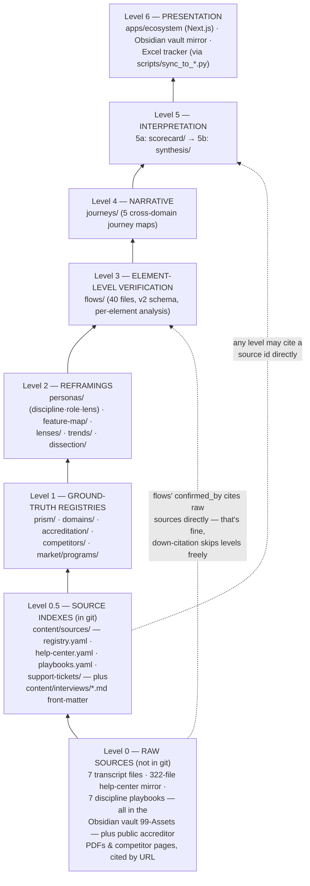

# content/ Architecture — The Layered Evidence Model

**What this is:** the one document that explains how every `content/` subfolder relates
to every other one. The README lists the folders flat; this explains the *dependency
structure* between them. Reference document — scan it, don't read it cover to cover.

**Last updated:** 2026-09-12

---

## The one rule that matters

> **Every file cites only the level(s) below it. Never sideways. Never up.**

That's the whole architecture. Everything else in this document is elaboration.

**Why the rule exists — citation laundering.** This repo exists to answer questions
like "does Prism satisfy COCA element 6.10?" for an audience (leadership, marketing,
eventually accreditors' customers) that will act on the answer. The failure mode of
research repos is *circular evidence*: a synthesis doc asserts X, a journey narrative
cites the synthesis, a flow file cites the journey, and six weeks later "confirmed"
means "we wrote it down three times." One layer's confident prose becomes the next
layer's ground truth, and no one can tell which claims trace to a transcript and
which trace to our own earlier guess. An accreditation-evidence research repo cannot
afford that — the entire pitch is *computed, traceable evidence*. So the citation
graph is a strict DAG pointing downward, and `git blame` plus a `source:` field on
every claim is the audit trail.

This is why `flows/_TEMPLATE.yaml` says, in so many words: *never re-derive from the
journey's own narrative, which would be citing our own synthesis as ground truth.*
That local rule is just this global rule applied to one edge.

**The analogy that fits: a legal case file.** Raw testimony (transcripts, the
help-center mirror) → exhibits entered into the record (the Level-1 registries, each
fact tagged with where it came from) → deposition-grade verification (flows, checked
element by element) → the brief (journeys, the narrative built on verified facts) →
the argument (synthesis and positioning, what we tell the room). A brief that cites
its own argument gets thrown out; so does a flow that cites its journey. And like
geological strata: when new evidence lands, a lower layer is *annotated, not silently
rewritten* — see the dated correction block at the top of `synthesis/gap-analysis.md`,
where Pattern G ("Prism has no matching layer") was overturned by the internal PA/OT
playbooks and the correction was left visible instead of the claim being quietly
edited. Upper layers can reference a lower stratum; they cannot contradict it without
first fixing the stratum itself.

---

## The levels

Arrows point in the *citation* direction inverted — each level may cite anything at
any level below it (skipping levels is fine; flows cite Level 0 transcripts directly).
No level cites its own level or above.

---

## Level 0 — Raw sources (live in the Obsidian vault, NOT in this git repo)

| Source | Where it lives |
|---|---|
| 7 transcript files (16-part admin tutorial series + 6 discipline video sets: TE, SLP, PT/PTA, PA, OT/OTA, Nursing) | `PRISM-Expansion-Vault/99-Assets/` |
| 322-file help-center mirror (Exxat Prism Help Center extraction) | `99-Assets/documents/Exxat-Help-Guides/` |
| 7 internal discipline playbooks (PT, OT, PA, SLP, Nursing, Social Work, Teacher Education) — indexed in `content/sources/playbooks.yaml` | `99-Assets/documents/Playbooks/` |
| 3 CSS & CX Zendesk knowledge-base screen captures (PA, OT, PT — "FireShot Capture 002/003/004"), named only in `prism/capability-map.yaml`'s source list; nothing else cites them | `99-Assets/` |
| Public accreditor standards PDFs (COCA 2026, ACPE 2025, CODA, LCME) and competitor marketing/docs pages | cited by URL from Level 1 |

These are the testimony. They are deliberately *outside* git (size, copyright,
internal-doc hygiene) but every in-repo claim that rests on them names the exact file
or article path in a `source:` / `confirmed_by:` field, so the chain of custody
survives the repo boundary.

`interviews/` is the in-repo slot for real CS/AM/leadership and domain-expert sessions
as Romit conducts them. First populated 2026-08-26 with two Granola meeting transcripts
(lightly cleaned of tech-support tangents, substance kept verbatim); 4 files as of
2026-09-11. The interview *body* is raw testimony and nothing in it cites upward.

**The one file that sits at two levels, and why that isn't a contradiction.** Since
2026-09-11 every interview file also carries a YAML **front-matter block** (`id`, `type`,
`date`, `participants`, `domains`, `access`, `evidence_status`, `claims_are_speaker_opinion`,
`supersedes`, and `recording` where one exists). That block is not testimony — it is an *index entry* for the
testimony below it, the same shape of record a `sources/registry.yaml` entry is, and it is
what makes a session citable by `source_id` from anywhere in the repo. So: the transcript
body is Level 0, its front-matter is Level 0.5, and the only unusual thing is that the index
entry is co-located with the document it indexes instead of living in a separate registry
file. Read Level 0.5 below for how that block is validated and resolved.

## Level 0.5 — Source indexes (`content/sources/` + interview front-matter, in git, cite nothing)

**Five source homes**, not four folders: three in-repo index files, one snapshot folder,
and the front-matter of every `content/interviews/*.md`. They are citable
by any file at any level and cite nothing themselves. `registry.yaml` is the general
one — sparse, curated, one entry per individually found-and-checked source, referenced
by `source_id`. `help-center.yaml` and `playbooks.yaml` are dedicated *corpus* indexes
for the two Level 0 bodies too large and too internally-addressed for a flat registry
entry: the 322-file help-center mirror and the seven discipline playbooks. Use a corpus
index when a citation needs a per-citation `locator:` (a page, section, line range or
anchor *within* one document) alongside the `source_id`, which a flat registry entry
can't express cleanly; their ids are prefixed `help-center-` and `playbook-`.

An index entry is a pointer, not evidence. Both corpus files record a `path_status:` /
provenance note distinguishing a path quoted verbatim from an existing in-repo citation
from one nobody has opened, and both state that their `what_it_supports:` summaries
restate what an in-repo Level-1/Level-3 file asserts rather than a fresh reading of the
Level-0 document. Citing an index id back at the file its summary was derived from
would launder a claim, not corroborate it.

`support-tickets/` is the third shape: not an index of documents that live elsewhere but a
point-in-time *snapshot* of helpdesk data, one file per domain per capture date
(`<domain-slug>-<YYYY-MM-DD>.yaml`, ids prefixed `support-ticket-`). It exists because
support data was previously fetched live and rendered straight to the UI, which put an
uncited claim on screen and kept the reasoning for which tickets were chosen in a
source-code comment. Each snapshot therefore carries `selection_method`, `selection_query`
and `coverage_caveat` as first-class fields, and every ticket carries `redacted:` — false
until a human has read it for personal data. `scripts/snapshot_zendesk.py` writes these
files and is not permitted to set `redacted: true`. A snapshot records only what the
helpdesk actually returned; unknown fields stay null rather than being filled in.

`content/interviews/*.md` **front-matter** is the fifth home (added 2026-09-11, the
*session* schema — see the Level 0 note above for why the same file sits at two levels).
It exists because sessions were previously cited two different ways: some by a hand-written
`sources/registry.yaml` entry, some by bare filename. The front-matter makes every session
carry its own id, `type`, `access` and `evidence_status` (`verbatim-cleaned` vs.
`summary-only` — a real distinction for a reader deciding how much weight a quote carries),
and `claims_are_speaker_opinion`, which is the honest default: a colleague's read of the
market is testimony about what they believe, not a market fact.

Two mechanical notes that bite people. **An interview id is not derivable from its
filename** — one of them deliberately differs from its filename slug so it matches an id
already frozen in `sources/registry.yaml` that existing citations point at; ids are always
read from front-matter. And all five homes resolve through **one** union loader,
`_load_source_ids()` in `scripts/check_content_density.py`, so any `source_id` /
`sources:` reference anywhere in `content/` may name an id from any of them; the
front-matter blocks themselves are validated by `check_sessions_integrity()` in the same
script. `sources/vendor-comparison-chart.yaml` is pointedly *not* a sixth home — it is
quarantined `citable_as_fact: false` (see "Outside the strata").

## Level 1 — Ground-truth registries (cite only Level 0)

Five folders, one question each. These are the exhibits: flat factual records where
every non-trivial claim carries a `source:` pointing at Level 0.

| Folder | One file per | Question it answers |
|---|---|---|
| `prism/` (`capability-map.yaml`) | — (single file) | What does Prism *actually* ship, per internal docs — not assumptions? Defines the pillar vocabulary (shipped vs. 2027 roadmap) and named primitives everything above reuses. |
| `domains/` | expansion domain (do, pharmacy, dentistry, medicine) | What is the market context — program counts, enrollment trends, budget dynamics? |
| `accreditation/` | accreditor (13 files as of 2026-09-12 — the 4 expansion-domain accreditors coca, acpe, coda, lcme, plus acote, arc-pa, caa-asha, caep, capte, coa, counseling, cswe, nursing for the existing disciplines) | Standard → evidence programs must produce → required software behavior → Prism fit (**Transfer / Configure / Build / Gap**), at the numbered-element level. |
| `competitors/` | incumbent (17 files as of 2026-09-12: axium, castlebranch, core-elms, e-value, elentra, emedley, examsoft, experiential-learning-cloud, influx, leo-davinci, medhub, new-innovations, one45, pharmacademic, rxpreceptor, trajecsys, typhon) | Feature-level teardown of each incumbent, from their public docs. |
| `market/programs/` (new 2026-09-11) | expansion domain (pharmacy, do, dentistry, medicine) | *Which* programs, one row each — institution, program name, accreditation status, Exxat relationship, other disciplines already on that campus. The row-level evidence under `domains/{slug}.yaml`'s aggregate `market_sizing:` block. |

**`market/programs/` — why a fifth registry, and what it may not do.** `domains/{slug}.yaml`
already carried a `market_sizing:` block, but its TAM/SAM numbers were asserted at the
aggregate level with nothing underneath them to check. `market/programs/{slug}.yaml` is that
missing layer: one row per tracked program, each row transcribed from the Level 0 CRM export
(the "new logo grid" spreadsheet) verbatim and in sheet order, with a `locator:` naming the
exact sheet cell the name came from, so the file can be re-derived rather than trusted. Every
file opens with a "HOW THIS FILE WAS BUILT" header recording how the sheet's own status text
was mapped onto this repo's enums and what was left `unknown` rather than guessed — a blank
cell never becomes a pipeline number. Three standing cautions: the source of record stays the
spreadsheet, so **no contact PII** is mirrored into git (counts, status and structure only);
row semantics differ per file and must be read before aggregating (DO's rows are *teaching
locations*, not institutions — 14 institutions repeat); and an empty list can mean "checked,
nothing there" or "never matched", which is why aggregates branch on an explicit flag like
`grid_matched:` and never on the wording of a `notes:` field. `domain:` here is the
**app-level label** ("Medicine"), not always the raw `domain:` string the sibling registry
uses ("MD"); `check_market_programs_integrity()` and `check_market_sizing_integrity()` in
`scripts/check_content_density.py` enforce both that and the rows-vs-aggregate relationship.

**The relay-race baton — how a Level-1 primitive propagates.** The capability map
names Prism's *anchor-relative scheduling* primitive: publish/due dates set as
"N days before/after a placement's start/mid/end anchor," not as fixed calendar
dates. A fixed date is a starter's pistol at a scheduled clock time; anchor-relative
is a relay baton — the midpoint-evaluation leg starts *when the placement's baton
arrives*, wherever that lands on the calendar, for every student on every offset
rotation simultaneously. Because that fact is established **once, at Level 1, with a
transcript citation**, every layer above can reuse it without re-proving it:
`accreditation/lcme.yaml` rates element 9.7 (date-anchored midpoint feedback) as
mapping "almost one-to-one" onto it, `feature-map/do.yaml` builds an opportunity on
it, the scorecard's pillar-fit rationale weighs it, and `prism-positioning.md` sells
it. One exhibit, cited five times — never re-asserted from memory.

Note the internal cross-reference direction *within* Level 1:
`accreditation/*.yaml`'s `prism_fit_rationale` names pillars from
`prism/capability-map.yaml`. That is the one tolerated intra-level edge, and it only
points at the capability map (the vocabulary source), never between peer registries.

## Level 2 — Reframings (cite Level 1 and below)

Same facts, rotated to face a different audience. No new primary claims — a Level-2
file that needs a new fact sends it down to Level 1 first.

| Folder / file pattern | What it reframes |
|---|---|
| `personas/discipline-*.yaml` (12: the 4 expansion domains **plus** the 8 existing disciplines — nursing, OT, PA, PT, SLP, social-work, TE, CRNA) | The *program* as archetype: accreditation pressure from `accreditation/`, current tools from `competitors/`, JTBD, switching triggers. |
| `personas/role-*.yaml` (5: program-admin, clinical-coordinator, compliance-accreditation-liaison, dean, preceptor) | The same evidence base sliced by human role instead of by discipline. |
| `personas/lens-*.yaml` (6) | Mirrors `competitors/<slug>.yaml` "reframed around roles, not features" — how each incumbent implicitly serves or fails each role, and the gaps Prism can exploit. |
| `feature-map/*.yaml` (4, one per expansion domain) | Pillar-by-pillar competitive verdict per domain (leading / behind / opportunity), citing `accreditation/` elements and `competitors/` files by name. |
| `dissection/*.yaml` (one per expansion domain) | Not the facts themselves but *where they are* — a per-domain manifest naming, for each of six fixed dissection questions, which file already answers it and how far along the research is (`coverage` / `confidence` / `gap_note`), pointing at the lenses and registries that hold the actual claims and duplicating none of them. Same "no new primary claims" rule as `personas/` and `feature-map/`; because it asserts nothing it carries no `sources:`, and an unanswered question stays visible as `coverage: "none"` plus a `gap_note` rather than as a missing field. |
| `lenses/accreditor-tiers.yaml`, `lenses/competitor-landscape.yaml` (the original 2, 2026-08-26) | Cross-cutting rows×columns quick-scan views spanning all 13 domains at once, requested directly by the sales/product team (see `interviews/2026-08-26-wilson-nursing-crosswalk.md`). `accreditor-tiers` cites `accreditation/`, `domains/`, and `interviews/`; `competitor-landscape` cites `competitors/` by name (`threat` is this file's own synthesis judgment, not a field lifted from Level 1). |
| `lenses/standards-competitor-ratings.yaml`, `lenses/standards-use-cases.yaml` | The same reframing done at *element* granularity, keyed by (domain, `element_id`). Ratings cites `accreditation/` by `element_id` and `competitors/` by slug; use-cases cites `accreditation/` and a `source_id`. They exist as lenses rather than as fields on `accreditation/*.yaml` because Level 3 flows already cite `accreditation/` — hanging the answer off Level 1 would close a citation cycle. |
| `lenses/product-gaps.yaml`, `lenses/competitor-differentiation.yaml`, `lenses/feature-comparison-matrix.yaml` (new 2026-09-11) | The three lenses that own answers to specific *dissection questions* (below). `product-gaps` = "what should we build for this domain," as a countable list of gaps rather than a paragraph of strategy. `competitor-differentiation` = per-(domain, competitor) head-to-head reasoning, and the only home in the repo for the **non-product** axes (distribution, incumbency, price, services) that decide deals and fit nowhere in a feature teardown. `feature-comparison-matrix` = the feature/pillar-level sibling of `standards-competitor-ratings`. All three cite `domains/`, `competitors/`, `prism/capability-map.yaml` and Level 0.5 `source_id`s downward and assert nothing that isn't grounded there. |
| `archetypes/*.yaml` (new 2026-09-13 — **zero entries today**, the directory holds only `_TEMPLATE.yaml`) | Institutions re-cut by *vendor footprint*: whether Exxat, a competitor, or nobody is already inside the university, with the checkable traits that place one in a segment and the approach that follows. Cites `market/programs/*.yaml` for the named institutions behind a segment, `competitors/*.yaml` for a footprint claim about a vendor, and Level 0.5 source ids. Distinct from `personas/discipline-*.yaml`, which is the *discipline* program archetype, not an institutional segment. The family is empty on purpose: `interviews/2026-09-12-romit-ruchi-pharmacy-domain-planning.md` records archetype universities as consultant-side strategy work that was assigned and has not been done, so `/archetypes` renders that absence rather than an illustrative entry. |
| `trends/*.yaml` (one per expansion domain) | What is *changing* in the domain — standards revisions, pedagogy and capacity shifts, AI pressure — each trend tagged with Exxat's status against it (`exxat_status` / `exxat_ref` from `prism/capability-map.yaml`) and which competitors, if any, already address it. Cites `prism/`, `competitors/` and Level 0.5 source ids. |

**The six dissection questions, and which file owns each.** A `dissection/{slug}.yaml`
manifest has exactly six `questions[]` entries, keyed `features-to-build`,
`competitor-differentiation`, `market-size`, `feature-comparison`, `standards-to-product`
and `persona-and-document-lens`. The manifest holds no answers — each question's `answered_in`
names the file that does, and all four real manifests agree on the mapping:

| Question `key` | `answered_in` |
|---|---|
| `features-to-build` | `lenses/product-gaps.yaml` |
| `competitor-differentiation` | `lenses/competitor-differentiation.yaml` · `competitors/*.yaml` |
| `market-size` | `domains/{slug}.yaml#market_sizing` · `market/programs/{slug}.yaml` |
| `feature-comparison` | `lenses/feature-comparison-matrix.yaml` |
| `standards-to-product` | `lenses/standards-use-cases.yaml` · `lenses/standards-competitor-ratings.yaml` |
| `persona-and-document-lens` | **Not a file of its own** — computed from the `audience` / `persona_relevance` tags and `sources[]` already carried by the lenses above |

Two of these are easy to get wrong from memory, so note them: `standards-to-product` is
answered by the two `standards-*` **lenses**, not by `accreditation/` directly (Level 3 flows
already cite `accreditation/`; routing the answer back through it would close a citation
cycle — the same reason those lenses exist at all), and `persona-and-document-lens` has no
owning file at all, `personas/` included. Each row also carries an honest `coverage` /
`confidence` / `gap_note`. That is the point of the family: an unresearched question stays
*visible* as `coverage: "none"` plus a `gap_note`, instead of disappearing as a missing field.

**Sparse by design — the convention that makes these lenses readable.** In
`standards-competitor-ratings`, `standards-use-cases`, `product-gaps`,
`competitor-differentiation`, `feature-comparison-matrix` and `trends`, **an absent row
means UNRESEARCHED, never "we checked and there is nothing here."** Do not pre-populate
rows to make a domain look covered: an invented row is indistinguishable from a researched
one the moment it is committed, and a fully-populated grid of 1,000+ empty cells is noise
for zero information. Several of these files were deliberately committed *empty* and filled
in later by real research passes.

**Two different things are both called "feature comparison" — don't merge them.**
`apps/ecosystem/lib/content.ts`'s `getFeatureComparisonForDomain()` is a pure
re-visualization of `competitors/*.yaml`'s existing `feature_teardown`, scoped per domain by
`domains_served`, and needs no content file at all. `lenses/feature-comparison-matrix.yaml`
is a separate, researched Level-2 file with its own reader, its own per-cell `sources:`, and
a *required* two-value `evidence_strength` enum so that "verified" is written down rather
than inferred from a missing flag. The lens file is not the derived view's backing store,
and the two are free to disagree — if they do, that disagreement is information.

**`related_flows` is navigation, not a citation — the one deliberate exception to "never
up."** `personas/jtbd`/`top_pains`/lens entries carry an optional `related_flows:
[{flow, step?, element?}]` field naming a `flows/*.yaml` file (Level 3) by filename. Read
literally, a Level-2 file naming a Level-3 file points *up* the strata, which looks like
exactly the citation-laundering pattern this document's one rule exists to forbid. It
isn't: `related_flows` grounds nothing — the persona entry's actual evidence is unchanged
(`evidence_or_rationale` / `accreditation_link`+`source` / lens `sources:`, all Level
0-1). The field only tells a reader "you can see this same point verified element-by-
element over here." This is the same footing `flows/*.yaml`'s own `maps_to_journey`
field already stands on — a Level-3 file naming a Level-4 journey, tolerated for
identical reasons. Both fields are wayfinding, not evidence.

## Level 3 — `flows/` — element-level verification (cites Levels 0–2)

40 files as of 2026-09-12, **schema v2** (2026-08-24), named
`<journey-slug>--<NN>-<stage-slug>.yaml` — one file per journey *stage*, across five
journey families (accreditation-self-study ×8, admin-onboarding ×8,
competency-verification ×8, preceptor-site-onboarding ×8, rotation-lifecycle ×8).

This is the deposition layer: screen-by-screen, and under v2, **element-by-element**
— `accreditation_citation`, `competitor_equivalent`, `gap_severity`, `gap_note` live
on each field, button, column, or toggle, not aggregated to the screen. Two hard
disciplines, both instances of the one rule:

- `confirmed_by` on every step names an exact **Level 0** source (help-center path,
  playbook, transcript section) — a flow asserts what a screen does because a
  document shows it, never because the journey narrative said so.
- `competitor_equivalent` is filled only where the competitor's public docs
  (Level 1's evidence base) support the comparison *at element granularity* —
  otherwise it says so explicitly rather than guessing.

Flows are the ground truth that journeys cite — the dependency runs strictly
flows → journeys, even though journeys were often *drafted* first. When a journey
stage gets its flow files written, the journey is thereby verified from below, not
the flows justified from above.

## Level 4 — `journeys/` — cross-domain narrative (cites Levels 0–3)

6 files as of 2026-09-12: `rotation-lifecycle`, `accreditation-self-study`,
`preceptor-site-onboarding`, `competency-verification`, (new 2026-08-24)
`admin-onboarding-product-setup` — the first journey scoped to **all eleven
disciplines** rather than the four expansion domains, which is why it carries
`discipline_variance` per stage instead of `domain_variance` — and
`pharmacy-core-to-exxat-migration`, the one journey scoped to a **single** domain.

Two things about that last file are load-bearing and easy to miss. It is the only
journey with **no `flows/` files under it** (all 40 flow files belong to the other five
families, 8 each), so it is not verified from below the way the rule below describes.
And its own header says why that is acceptable rather than sloppy: no pharmacy program
has actually made this move on record, so the journey is *the shape of* a migration
derived from what ACPE requires and what the two platforms are documented to hold —
a use case the GTM team wants, explicitly not a recorded customer outcome. Every stage
in it is written in that register.

The brief: stage-level narrative per journey — current state in Prism, pain/gap,
accreditation link, competitor comparison — with each stage's Prism assertions traced
to named flow files, transcripts, or Level-1 registries. Journeys are the
*cross-domain comparative* layer; flows are the *single-product verification* layer
under them. A journey may say "this stage is where COCA 6.10 evidence should fall
out"; only a flow may say "and here is the exact column on the exact screen that
produces it."

## Level 5 — Interpretation (cites Levels 0–4)

Two sub-strata, because positioning cites the scorecard:

**5a — `scorecard/where-to-play.yaml`.** The quantitative verdict: weighted criteria
(market size, accreditation pressure, incumbent weakness, pillar fit, …) scored per
domain, every rationale cell citing `domains/`, `accreditation/`, `competitors/`,
`personas/`, and `prism/capability-map.yaml` by name. Current answer: DO 4.40 >
Pharmacy 4.05 > Medicine 3.85 > Dentistry 2.75.

**5b — `synthesis/`.** The argument, in four cross-domain documents plus a per-domain
folder each:

| File | Role |
|---|---|
| `gap-analysis.md` | Cross-cutting patterns (A, B, … G) across all four domains; carries the visible Pattern-G correction block — the model example of annotating a stratum instead of rewriting it. |
| `vocabulary-glossary.md` | The "vocabulary-ahead" glossary: term → definition → Prism pillar → how to say it to a dean; every entry cites its on-disk Level-1 file *and* that file's primary source. |
| `prism-positioning.md` | The GTM brief — explicitly "a positioning brief, not a research document," downstream of journeys (element-verified via flows), the capability map, and the scorecard. |
| `positioning-and-element-flows-plan.md` | The plan document that specified the v2 flow methodology and positioning approach — process record, kept for traceability. |

**`synthesis/{slug}/` — the same argument, cut by reader.** Each expansion domain
(`pharmacy/`, `do/`, `dentistry/`, `medicine/`) has a folder of four files: `index.md`
(a "who are you?" router), `PRODUCT.md` (for PMs and executives), `DESIGN.md` (for
designers), and `SALES.md` (for sales/partnerships, read before a call). These are
*collations*, not new evidence: each opens with a `Source:` line naming the Level 1/2 files
it was built from, and the citation rule applies unchanged — a figure that appears here
must already exist, with its own source, in the file named. `SALES.md` is what the app's
"How we win" tab renders, via `apps/ecosystem/lib/sales-brief.ts`. Where the underlying
files disagree with each other, these briefs say so rather than picking a winner, and a
stakeholder decision that overrides the research (Pharmacy confirmed ahead of DO on
2026-09-10, against the scorecard's own math) is recorded as a visible dated note — the
same annotate-don't-rewrite discipline as the Pattern-G block.

`positioning-and-element-flows-plan.md` has **no page in `apps/ecosystem/` by
design** — it is a process record kept for traceability, not reader-facing content,
so its absence from the app is intentional and not a coverage bug. The other three
synthesis documents all still render, at their post-consolidation routes (2026-09-13):
`gap-analysis.md` and `prism-positioning.md` are now two of the three anchored steps of
`/go-to-market` (`#whats-missing` and `#what-to-say`), and `vocabulary-glossary.md`
renders at `/standards/glossary`.

Nothing below Level 5 ever cites anything in this folder. If a synthesis insight
deserves reuse, it gets pushed down: a fact goes to a Level-1 registry with a real
source, or it stays opinion and stays here.

## Level 6 — Presentation (renders Levels 1–5; asserts nothing)

- **`apps/ecosystem/`** — the Next.js + shadcn/ui + d3/Observable Plot app that reads
  `content/` at request time for a leadership/marketing audience. Display only; it
  contains no research claims of its own.
- **Obsidian vault mirror** — `scripts/sync_to_vault.py` mirrors `content/` into
  `PRISM-Expansion-Vault` (the human-owned folders — 00-Inbox, 40-Interviews,
  70-GTM-with-Ruchi, 90-Templates — are never overwritten). Note the loop this does
  *not* create: the vault's `99-Assets` is Level 0 *input*, and the mirrored
  `content/` copies are Level 6 *output*; they share a vault but nothing in the
  citation graph flows output-side back in.
- **Excel tracker** — `scripts/sync_to_tracker.py` pushes scorecard and teardown
  status into `PRISM_Domain_Research_Tracker.xlsx`.

---

## Outside the strata

- **`enterprise-repo/tool-comparison.md`** — meta-document about the repo itself
  (why git/YAML over Dovetail/Notion/Airtable). Not part of the evidence chain;
  cites nothing in it and nothing cites it as evidence.
- **`interviews/`** — Level 0 primary sources held in-repo (see Level 0 above); 4 files
  as of 2026-09-11. Only the transcript *body* is outside the strata in this sense: each
  file's YAML front-matter is a Level 0.5 source-index entry, validated by
  `check_sessions_integrity()`, and is how the session is cited.
- **`_TEMPLATE*.yaml`** — each YAML folder carries its schema as a template file;
  templates are the enforcement mechanism for this document's rules at
  point-of-writing.
- **`gtm/`** (`research-pipeline.yaml`, `collateral.yaml`, new 2026-09-11) — internal
  planning and work status: who is doing which of the seven research stages on which
  domain and at what status, and what collateral (whitepapers, podcasts, webinars,
  videos, sandboxes, use-case one-pagers, conference abstracts) is planned, in review,
  or published. **These are not research findings.** A row saying "we intend to
  interview ten deans" or "this webinar is in drafting" asserts nothing about the
  market, so it carries no `source:` — requiring one would be a category error.

  The isolation rule runs one way only: a `gtm/` file may point **at** `content/` (via
  `produces:` / `grounded_in:`), but nothing in `content/` may ever cite a `content/gtm/`
  path or id as evidence. Otherwise a plan would launder itself into a finding — the
  same failure `sources/vendor-comparison-chart.yaml` is quarantined to prevent from the
  other direction. This is mechanically enforced by `check_gtm_isolation()` in
  `scripts/check_content_density.py` — the check has landed and runs on every
  `python3 scripts/check_content_density.py`, so the rule is no longer only a header
  comment.

  The one legitimate bridge back into the citation DAG is `collateral.yaml`'s
  `becomes_source_id:`. Once an asset is actually published it exists in the world, and
  the published artifact — not the tracking row — gets a normal Level 0.5 source entry
  (`sources/registry.yaml` already carries `webinar`, `podcast`, `video` and
  `conference` types) and is cited by that id like any other source. Registering it
  doesn't make its claims true: a first-party sales/marketing artifact is
  `type: "sales-collateral"` and belongs in a `citable_as_fact: false` home, uncitable
  as fact by the same rule as the vendor chart.

## Quick reference — "where does my claim go?"

| You have… | It goes in… |
|---|---|
| A fact from a transcript, help-center article, playbook, standards PDF, or competitor page | The relevant **Level 1** registry, with a `source:` naming the Level 0 file/URL |
| A named individual program — its institution, accreditation status, or whether it's an Exxat client | **`market/programs/{slug}.yaml`** (Level 1), one row, `locator:` naming the sheet cell |
| A transcript or notes from a call you just had | **`interviews/`** — body is Level 0, and give it front-matter (Level 0.5) so it can be cited by id |
| The same facts re-cut for a program archetype, human role, or competitor-through-a-role lens | **`personas/`** (Level 2) |
| A segment of *institutions* defined by which vendor is already inside them | **`archetypes/{slug}.yaml`** (Level 2) — one file per segment; the named institutions in it stay rows in `market/programs/` |
| A pillar-level competitive verdict for one domain | **`feature-map/`** (Level 2) |
| A specific thing we should build for a domain, or why a named competitor wins/loses there | **`lenses/product-gaps.yaml`** / **`lenses/competitor-differentiation.yaml`** (Level 2) |
| A per-capability rating of a competitor against Prism, with its evidence strength | **`lenses/feature-comparison-matrix.yaml`** (Level 2) |
| Something that is *changing* in the domain, and where Exxat stands against it | **`trends/{slug}.yaml`** (Level 2) |
| Not a claim at all, but *where* a domain's answer lives and how far the research got | **`dissection/{slug}.yaml`** (Level 2) — a pointer plus `coverage`/`gap_note`, never a fact |
| What one screen/element actually does, and how a standard or competitor attaches to it | **`flows/`** (Level 3), `confirmed_by` a Level 0 source |
| A cross-domain narrative of how a whole workflow feels today vs. its gaps | **`journeys/`** (Level 4), citing its flow files |
| A weighted domain-priority score | **`scorecard/`** (Level 5a) |
| An argument, pattern, glossary entry, or message | **`synthesis/`** (Level 5b) |
| A ready-to-read brief on one domain for a PM, a designer, or sales | **`synthesis/{slug}/`** (Level 5b) — a collation whose every figure already exists, sourced, in a file it names |
| A way to *show* any of the above | **`apps/ecosystem/`** (Level 6) |
| A work assignment, a research intention, or a piece of planned/published collateral — a statement about *us*, not about the world | **`gtm/`** (outside the strata — it may point *at* `content/`, but nothing in `content/` may cite it) |

And the test before committing any citation: **does the arrow point down?** If the
file you're about to cite is at your level or above, the claim either moves down to
where its evidence lives, or it doesn't get made.
